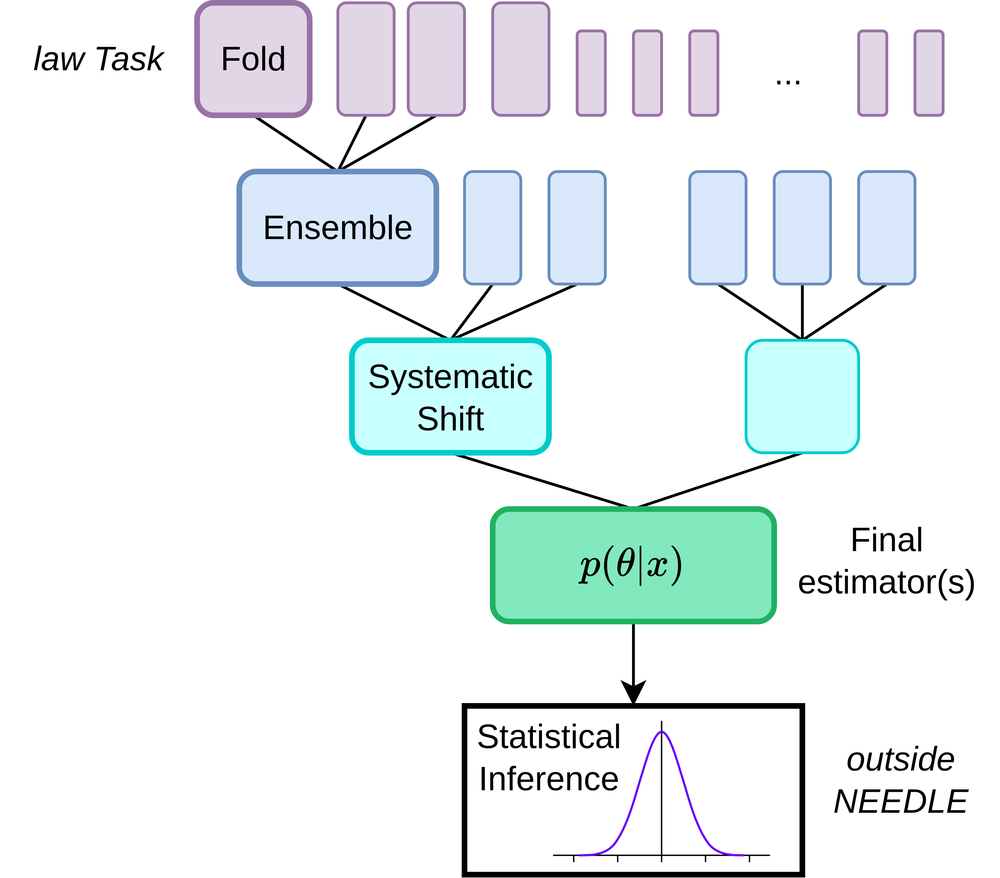

b2luigi Tasks
==============

b2luigi Tasks are NEEDLE's second workflow backend (see also :doc:`../law_tasks/index`), built
directly on plain ``luigi.Task`` plus `B2luigi <https://b2luigi.belle2.org/index.html>`__, the
Belle II collaboration's fork of Luigi. It follows the exact same DAG shape as the law backend
— Folds funnel down to a single MainTask — but every marker task is a plain ``luigi.Task``
(namespaced ``task_namespace = "b2luigi"`` to avoid colliding with the law backend's identically
named classes), and only ``TrainingTask`` inherits ``b2luigi.Task``.

Core Tasks
----------

.. toctree::
   :maxdepth: 2

   MainTask
   EstimatorTask
   SystematicTask
   EnsembleTask
   FoldTask
   TrainingTask
   DownstreamTask

Mixins
------

.. toctree::
   :maxdepth: 2

   mixins/index

Workflows
---------

.. toctree::
   :maxdepth: 2

   workflows/index
